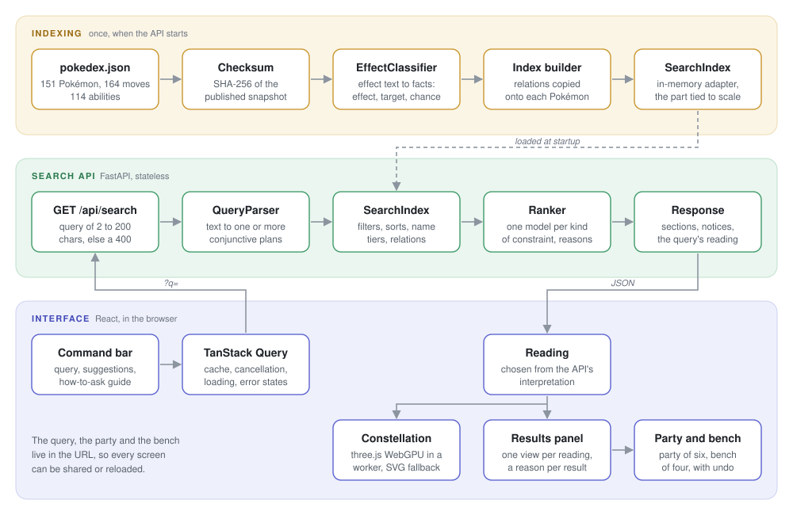
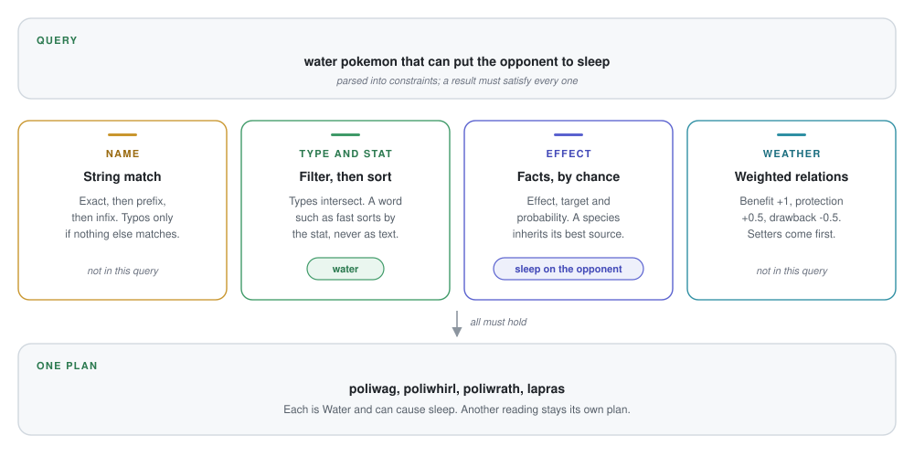
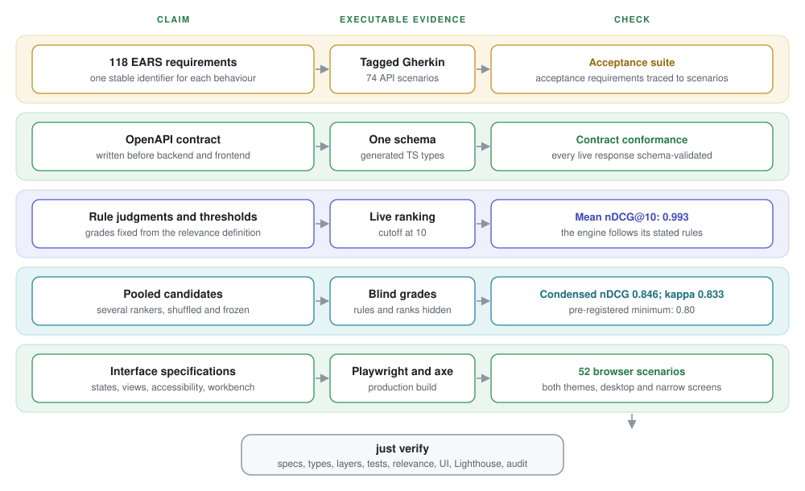
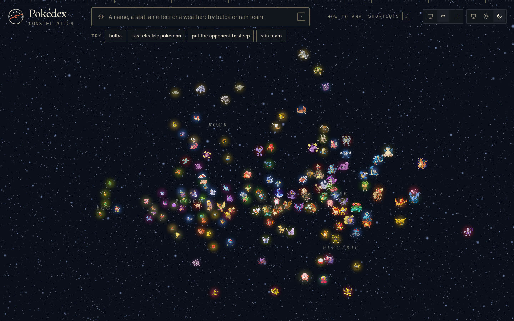
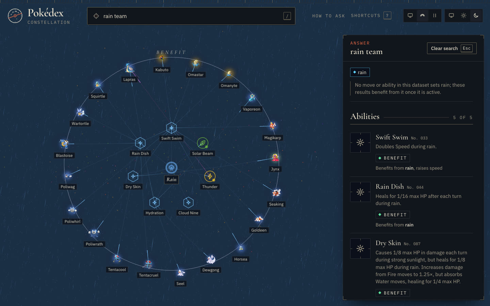
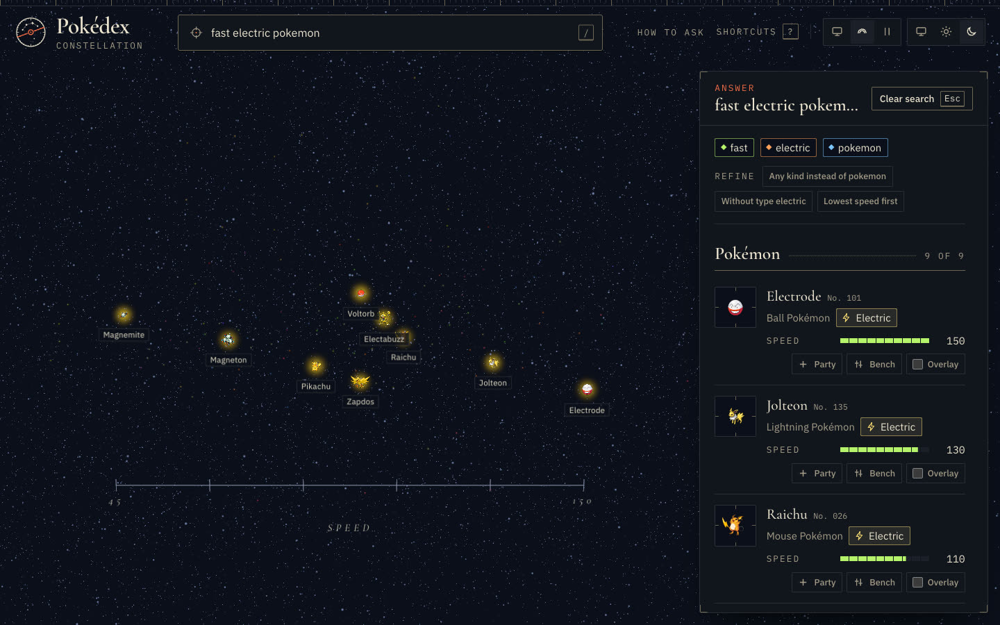
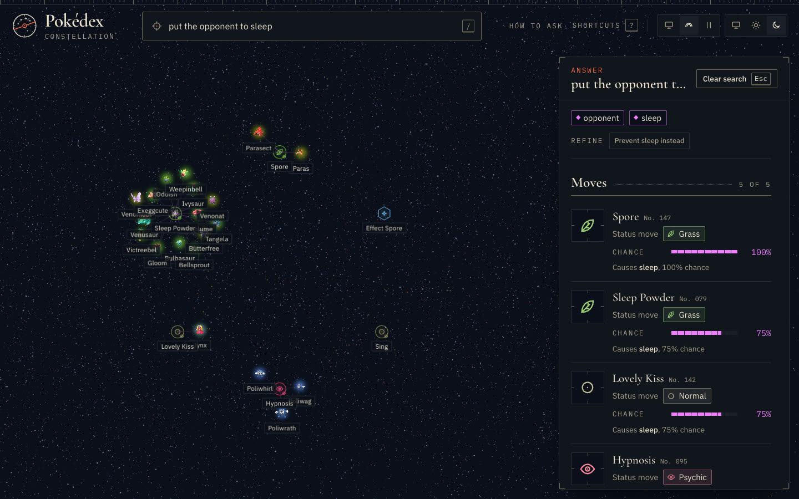
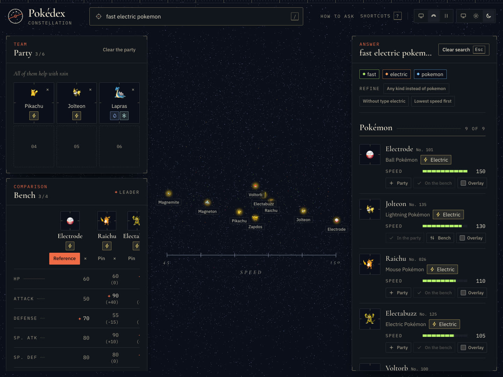
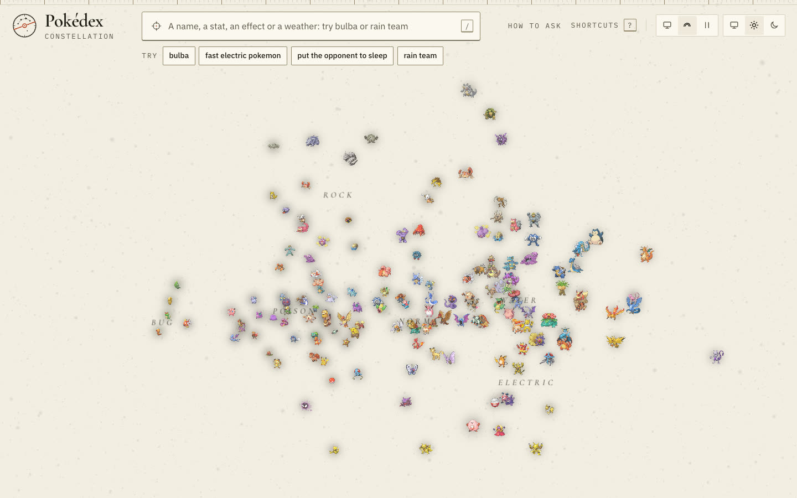

# Pokédex search

A search engine over the published `pokedex.json` snapshot (151 Pokémon, 164
moves, 114 abilities). You type a question in plain English; the API reads it
as a set of constraints, ranks the matching Pokémon, moves and abilities, and
says why each one matched. The interface shows the 151 species as a
constellation that rearranges itself for each query, next to an accessible
results panel, a party of six and a comparison bench.

The brief is kept in [`candidate-resources/`](candidate-resources/), with the
dataset's provenance and checksum.

## Setup, run and test

Requirements: [flox](https://flox.dev), or mise, just and process-compose
installed another way. flox installs those three, then mise installs the
runtimes pinned in `mise.toml` (Python 3.14, uv, Node 24, pnpm).

```sh
flox activate        # tools and runtimes
just setup           # dependencies, then download data/pokedex.json and verify its SHA-256
just dev             # API on http://127.0.0.1:8000, interface on http://127.0.0.1:5173
```

`just serve` and `just web` start the two processes separately. No
environment variable is required; the optional overrides are listed in
[`backend/.env.example`](backend/.env.example). The data stays in `data/`,
which is not committed.

| Command | What it runs |
|---|---|
| `just test` | Backend, tooling and frontend unit tests, with coverage thresholds on the frontend |
| `just check` | Lint, type checks, layer rules, unit tests, bundle size, spec consistency |
| `just acceptance` | The Gherkin scenarios of `specs/features` against a fresh API |
| `just relevance` | nDCG against the rule judgments and the blind assessor grades |
| `just ui` | The Playwright scenarios of `specs/ui` against the production build |
| `just verify` | All of the above, plus timing budgets, Lighthouse and a dependency audit |

`just ui` and `just lighthouse` need Chromium once:
`cd frontend && pnpm exec playwright install chromium`. The suites that need an
API start their own on port 8001, so a running dev server is never tested.

## User needs

All four situations of the brief are supported, and they can be combined in
one query.

| Need | Example | What the product does |
|---|---|---|
| Recover a partly remembered name | `bulba` | Exact, prefix, infix, then typo-tolerant name match; the best match opens as a card |
| Compare candidates on criteria | `fast electric pokemon` | Type filter, ranking by the stat asked for, stat bars, a bench to compare up to four side by side |
| Find a way to cause an effect | `put the opponent to sleep` | Moves and abilities that do it, ranked by chance of success; Pokémon with the move or ability they get it through |
| Explore a weather strategy | `rain team` | Abilities, moves and Pokémon grouped by role (benefit, protection, drawback), with the relations drawn in the scene |

Left out on purpose: evolution chains, items, type matchups and damage
calculation (absent from the snapshot or out of scope), competitive team
advice, languages other than English. Queries the parser cannot read are
answered honestly: ignored words are listed, and an empty result explains why
and suggests queries that work. An in-app guide ("How to ask") lists what can
and cannot be asked.

## Architecture and data flow



Besides `/api/search`, the API serves `/api/suggest` for suggestions while
typing, `/api/entities/{kind}/{name}` for a detail card, `/api/species` for the
constellation, and `/api/health`.

- **Backend** (`backend/`, FastAPI): `domain` holds the entities and the plan,
  `core` the parser, the effect lexicon and the ranking rules, `application`
  the use cases behind ports, `infrastructure` the dataset loader and the
  in-memory index, `api` the HTTP layer. Layer rules are enforced by
  import-linter. Input is validated (2 to 200 characters); errors come back as
  `{"error": {"code", "message"}}` with no stack trace.
- **Contract**: [`specs/api/openapi.yaml`](specs/api/openapi.yaml) was written
  before the code. The frontend types are generated from it, and the acceptance
  suite validates every response against it.
- **Frontend** (`frontend/`, React 19, Vite, Tailwind, React Aria): the
  interface never re-parses the query; it picks its view from the
  interpretation the API returns. The query and the workbench live in the URL,
  so any screen can be shared.
- **Tooling** (`tooling/`): dataset download and checksum, spec validation,
  acceptance steps, relevance evaluation and pooling for blind assessment.

## Five representative queries

Results from the published snapshot.

| Query | Top results | What it shows |
|---|---|---|
| `bulba` | bulbasaur, "name starts with the query" | Prefix match. `bulbsaur` also finds it, because typo tolerance only applies when nothing matches literally |
| `fast electric pokemon` | electrode (speed 150), jolteon (130), raichu (110), electabuzz (105), voltorb (100); 9 in all | "fast" sorts by base speed and is never matched as text; the type is a filter |
| `put the opponent to sleep` | Moves: spore 100%, sleep-powder 75%, lovely-kiss 75%, hypnosis 60%, sing 55%. Ability: effect-spore 10%. Pokémon: paras and parasect through spore first, 32 in all | Intent without vocabulary. Rest is excluded, since it puts the user to sleep, and so are abilities that prevent sleep |
| `rain team` | Abilities: swift-swim, rain-dish, dry-skin, hydration as benefits; cloud-nine as a drawback. Moves: thunder (benefit), solar-beam (drawback). 73 Pokémon, each with the move or ability that links it to rain | Relations across three kinds of entity, plus a notice that nothing in this snapshot sets rain |
| `water pokemon that can put the opponent to sleep` | poliwag, poliwhirl, poliwrath (hypnosis, 60%), lapras (sing, 55%) | Constraints of two needs combined in one conjunctive plan |

Two controlled cases: `psychic` is ambiguous (a type and a move name), and
the summary names both readings above Psychic-type Pokémon and moves;
`chikorita` is not in the snapshot and returns an empty outcome with an
explanation and example queries.

## Mathematics and algorithms

There is no single relevance score across the product. A name distance, a
base stat and a weather relation do not live on comparable scales. The parser
therefore builds one or more typed `SearchPlan`s, and each constraint keeps its
own retrieval model.



**Conjunctive retrieval.** Within one plan, candidate sets intersect:

$$
R = R_{\text{kind}} \cap R_{\text{type}} \cap R_{\text{stat}}
    \cap R_{\text{effect}} \cap R_{\text{weather}}
$$

A result must satisfy every constraint. Truly ambiguous readings become
separate plans; their scores are never added because the scales are unrelated.
The final deterministic tie-breaker is the dataset identifier.

**Names.** Matching proceeds in tiers: exact, prefix, infix, then fuzzy.
Fuzzy matching only runs when no literal match exists and uses
Damerau-Levenshtein distance, which counts insertions, deletions,
substitutions and adjacent transpositions. The bound is one edit for terms up
to five characters and two beyond that. Results sort by tier, edit distance,
length difference, then identifier.

**Stats.** Types and numeric bounds are Boolean filters. One requested stat
sorts by its raw value. Several stats cannot be averaged directly because
their distributions differ, so each value is converted to a mid-rank
percentile:

$$
p(x) = \frac{\#(v < x) + \#(v \leq x)}{2N}
$$

The rank is the mean of the requested percentiles. Derived values are explicit:
`total` is the sum of the six base stats, `bulk = hp + defense +
special-defense`, and `offense = max(attack, special-attack)`.

**Effects.** Effect text is classified once at indexing time into a fact:
effect, target, mode and probability. For a move:

$$
P(\text{effect}) = P(\text{move hits}) \times P(\text{effect}\mid\text{hit})
$$

Missing accuracy or effect chance means 100%, as in the snapshot. A Pokémon
inherits the facts of its moves and abilities and ranks by its best source,
then by the number of distinct sources. This is why Spore (100%) comes before
Sleep Powder (75%), and why effects on the user do not answer a request about
the opponent.

**Weather.** Weather strategy is a weighted relation graph. A benefit adds
`1`, protection or a mixed relation `0.5`, and a drawback `-0.5`; relations
through moves count half. Setters always rank first, then Pokémon sort by the
sum of their relation weights. Moves and abilities sort by their best role.

**Description fallback.** Words unexplained by a structured constraint use
BM25 over species descriptions. BM25 combines inverse document frequency with
saturating, length-normalised term frequency. It is deliberately a fallback:
lexical similarity alone does not model prefixes, polarity, targets or typed
relations.

**Constellation.** Each species starts as a feature vector of six standardised
base stats plus one-hot types weighted by `1.6`. The centred matrix is
projected onto its first three principal axes, found by power iteration with
deflation. For Euclidean distances this is the classical multidimensional
scaling solution used here. Fixed initial vectors and axis orientation make
the result deterministic; a bounded separation pass only moves points that
would overlap.

**Evaluation.** Ranking quality uses normalised discounted cumulative gain:

$$
\operatorname{DCG}@k = \sum_{i=1}^{k}
\frac{2^{g_i}-1}{\log_2(i+1)},
\qquad
\operatorname{nDCG}@k =
\frac{\operatorname{DCG}@k}{\operatorname{IDCG}@k}
$$

The exponential gain makes a grade-3 result substantially more valuable than
a grade-2 result, while the logarithmic discount rewards putting it near the
top. Blind grades use condensed nDCG: unjudged candidates are removed rather
than assumed irrelevant. Quadratic-weighted Cohen's kappa measures agreement
between the rule grades and the blind assessor.

## Decisions and trade-offs

The full reasoning is in 13 short records in [`docs/adr`](docs/adr).

**Relevance is defined per need, from structured data**
([ADR 2](docs/adr/0002-relevance-definition.md),
[ADR 4](docs/adr/0004-search-models.md)). The four needs are different
problems: spelling, attribute values, what an effect does to whom, and
relations between entities. I measured a naive full-text search on the judged
queries first: mean nDCG@10 of 0.55, against a target of 0.90. So each kind of
constraint gets its own model: tiered string matching for names, filters and
sorts for types and stats, extracted facts for effects, a weighted relation
graph for weather. A query becomes one conjunctive plan. BM25 over species
descriptions is kept only as a fallback. Embeddings were considered and set
aside: cosine similarity barely separates "cause sleep" from "prevent sleep",
which is exactly the distinction the intent need depends on.

**Effects are turned into facts at indexing time**
([ADR 5](docs/adr/0005-search-architecture.md)). A versioned rule lexicon
reads each short effect and records the effect, its target and its chance.
Pokémon inherit the facts of their moves and abilities, so "which Pokémon can
cause sleep" is a filter, not a join. The lexicon is hand-written, which is
fine for 278 moves and abilities but would not be for a larger corpus; the port is there
so a batch language model could replace it, as long as it produces the same
facts.

**Only the index depends on volume**
([ADR 5](docs/adr/0005-search-architecture.md)). At 429 entities the index is
in memory. The parser, the ranking and the contract were written so a much
larger catalogue would not mean a new product. [Scaling](#scaling) says how.

**The snapshot is followed exactly**
([ADR 3](docs/adr/0003-dataset-fidelity.md)). It mixes eras: generation I
moves, modern types, abilities from generation III on. I did not correct it
with game knowledge. When a strategy depends on a missing mechanic, such as
anything that sets rain, the response carries a notice instead of inventing
the fact.

**Specs before code** ([ADR 1](docs/adr/0001-specification-layers.md)).
Requirements are written once in EARS form (`specs/requirements.yaml`, 118
entries), hard rules as Gherkin scenarios tagged with those requirements, and
ranking quality as graded judgments. A tool checks that every requirement is
covered. This cost time early on, and it is what let the ranking change many
times without the tests being rewritten.

**Relevance is checked by someone other than its author**
([ADR 7](docs/adr/0007-relevance-validation.md)). Judgments derived from my
own rules score 1.00 by construction, so they only prove consistency. I pooled
the candidates of several rankers and had them graded blind by a separate
agent that could not see the rules, scores or ranks. The minimum score was
fixed before any grading. Each grading round brought new queries and the loop
did not converge, so the sheet was frozen; later queries count as regression
evidence, not as an independent measure.

**The interface shows the dataset as a whole**
([ADR 12](docs/adr/0012-constellation-on-webgpu.md)). A first interface was a
search box over cards, and a first redesign turned out to be the same layout
with a new skin; I reverted it. The constellation places the 151 species by
their stats and types, and each reading moves them: the best match comes
forward, candidates line up on a stat axis, carriers gather around a move,
Pokémon form rings around a weather. It runs in a worker so the page stays
responsive, and the results panel keeps every result in the DOM, so screen
readers and tests never depend on the canvas. The cost is complexity and a
lazy-loaded 3D chunk; the fallbacks (WebGL2, then an SVG still map for reduced
motion, slow devices or lost contexts) are part of that cost.

**Undo instead of confirmations**
([ADR 13](docs/adr/0013-workbench-and-undo-history.md)). Removing from the
party or the bench happens at once and can be undone with Ctrl+Z. The browser's
Back button stays for searches.

## Validation

The specifications are executable: each kind of claim has its own evidence
and check.



- **Unit tests**: 417 backend, 95 tooling, 223 frontend (coverage of 90% or
  more required on the frontend domain and API layers).
- **Acceptance**: 74 Gherkin scenarios against a running API, covering the
  brief's required cases (successful retrieval, empty and invalid input,
  no-result fallback) and hard rules such as "rest never answers a request to
  put the target to sleep".
- **Relevance**: `just relevance` reports a mean nDCG@10 of 0.993 against the
  rule judgments and 0.846 against the blind grades (pre-registered minimum
  0.80), with a weighted kappa of 0.833 between the two.
- **Interface**: 52 Playwright scenarios, axe checks in both themes,
  Lighthouse budgets, and a size limit on the initial JavaScript.

## Scaling

The snapshot holds 429 entities, so the first `SearchIndex` keeps everything
in memory. The split between parsing, indexing and ranking was chosen for a
larger catalogue, up to a million species, without shipping that
infrastructure now ([ADR 5](docs/adr/0005-search-architecture.md)).

What stays the same as the data grows:

- **The parser.** It depends on small vocabularies and the list of entity
  names, not on effect texts or relations. A plan is serialisable, and
  `parse(serialize(plan)) == plan` is tested.
- **The ranker and the contract.** The models of
  [ADR 4](docs/adr/0004-search-models.md) and `specs/api/openapi.yaml` do not
  mention the index. Notices come from facet counts, so they stay true when
  the data changes.
- **The shape of a query.** Relations are copied onto each Pokémon at
  indexing time. "Which Pokémon can cause sleep" is a filter and a sort, not
  a join across moves and abilities while the user waits.

What changes is the `SearchIndex` adapter. It exposes name matching,
conjunctive filtered sorts, relation lookups, facet counts, and opaque cursors
bound to the query, the section and the dataset version. The next adapter
would be PostgreSQL (`pg_trgm` for names, composite indexes for the filters)
or OpenSearch (n-grams and function scores). The API is stateless, so it can
be replicated, and identical queries can be cached by dataset version.

An external engine at 429 entities would add infrastructure and make local
review harder, for no gain.

The constellation does not follow this path. It is a view of the 151 species.
A larger catalogue would keep the same search API and need another way to
show it.

## Next steps

- A `SearchIndex` adapter on PostgreSQL, checked against the same contract and
  the same relevance thresholds, so the scaling claim is measured rather than
  described.
- A batch model in place of the hand-written effect lexicon, accepted only if
  it produces the same facts.
- A human grading pass on the frozen assessment sheet. The current blind
  grades come from a language model.
- Type matchups as data. `pokemon immune to ground moves` scores 0 because
  immunities are not modelled; `freeze the opponent` scores 0.66 on Pokémon.
  The remaining grade disagreements (starmie, tentacool, tentacruel for rain)
  still need a human decision.
- Team suggestions from the party: missing types, shared weaknesses.
- The constellation stays a view of these 151 species. Weaker machines already
  get the still map. Sprites load from PokéAPI and need a network connection;
  the search does not.

## How the project went

About 12 hours of work, in two stages. The commit history follows these steps.

**First stage: framing, specs, backend**

1. Read the brief, downloaded the snapshot and listed its gaps (mixed eras, no
   rain setter, long effects citing mechanics outside the file). Decided to
   support all four needs.
2. Before any code: for each need, example queries, what must and must not
   come back, and the traps. This became the three spec layers of ADR 1, the
   OpenAPI contract and the graded judgments.
3. Thought about the UX before freezing the contract, because the interface
   needs the interpretation as data (term roles, canonical query,
   refinements). The contract was extended accordingly.
4. Chose the retrieval models by measuring the naive baseline (ADR 4), then
   the architecture with scaling in mind (ADR 5), then the stack (ADR 6).
5. Blind assessment of pooled candidates (ADR 7). Adjudicating the widest
   disagreements corrected two rules. After three rounds the sheet was frozen.
6. Backend built layer by layer, test first: domain, query plans, effect facts,
   ranking, API, BM25 fallback.

**Second stage: environment, interface, iteration**

7. Development environment: flox, mise, just and process-compose, so a fresh
   clone runs with three commands.
8. Frontend libraries and engineering standards (ADR 9 to 11), UI scenarios in
   Gherkin, then a first interface with one view per reading.
9. The first interface worked but looked generic, and a first redesign only
   reskinned it; it was reverted. Started again from the question "what is
   this dataset?", which led to the constellation (ADR 12) and the workbench
   with undo (ADR 13), specified before being built.
10. Iterations from hands-on use: manual navigation of the scene (turn, pan,
    zoom, click), voice search removed, a visual identity with
    light and dark themes, type badges told apart by shape as well as colour,
    a query guide, compact results, and a motion setting that can override
    the system's reduced-motion preference.

## Use of AI tools

I used Cursor agents throughout: to draft specs and ADRs from my decisions,
write the code and tests, run the checks, and compare design options. A
separate agent served as the blind relevance assessor, with no access to the
rules or the code.

Review: changes went through `just verify` or the relevant part of it, and the
layer rules, strict type checks and coverage thresholds block the most common
shortcuts of generated code. I reviewed the ADRs and the ranking rules myself
and tried every interface change in the browser.

Changed or rejected suggestions:

- The agent proposed limiting criteria search to speed, the stat named in the
  brief. I rejected it: every base stat, the base stat total and derived
  stats such as bulk can be asked for and sorted on.
- Its first interface redesign kept the same layout with a new skin. I stopped
  it, reverted the commits and asked for a redesign starting from the UX, which
  became the constellation.
- It kept proposing new candidates to grade after each engine change. I
  stopped the loop and froze the assessment sheet, so the relevance score
  measures the engine rather than a moving target.

## Appendix: the interface

The home sky holds all 151 species. A query rearranges them, and the panel
beside it says why each result matched.









The same results can go into a party of six or onto a bench of four. The bench
below uses Electrode as the reference.



The light theme is a full alternative, not an inversion of the dark one.



A twelve-second walkthrough goes from the home sky to rain, a speed ranking,
and an effect. [Download the video](docs/media/interface.mp4) if it does not
play inline.

<video src="docs/media/interface.mp4" controls muted playsinline width="100%"></video>
